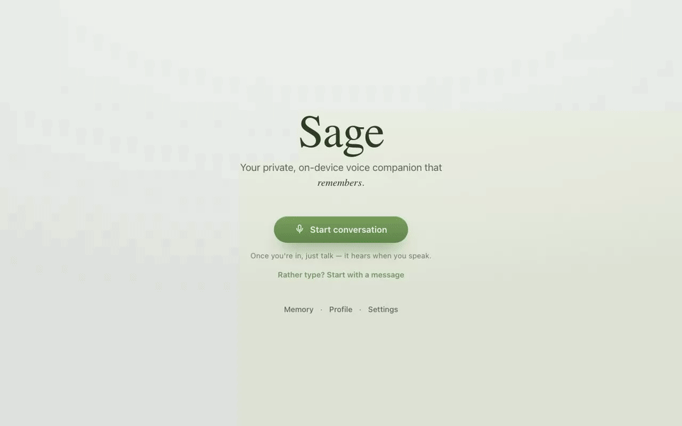
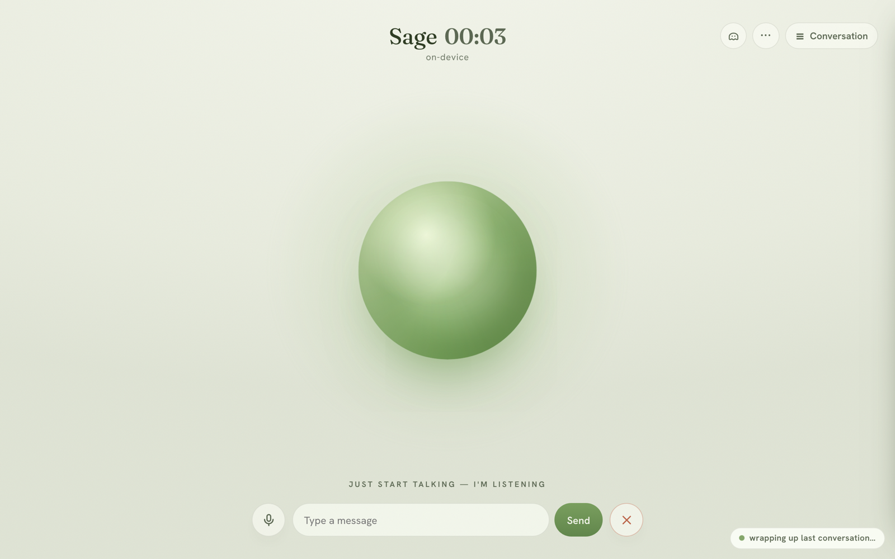
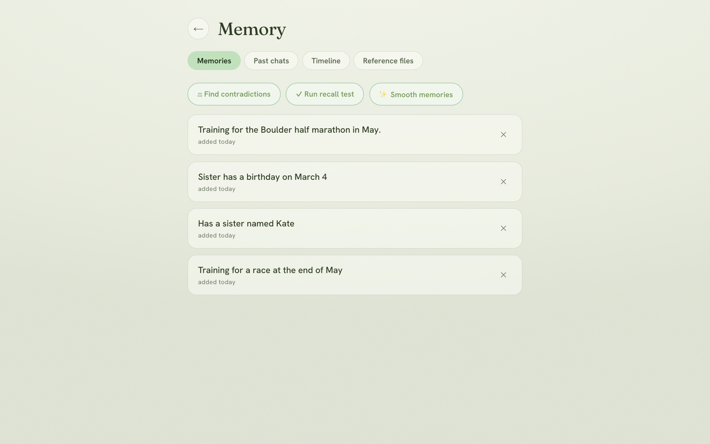
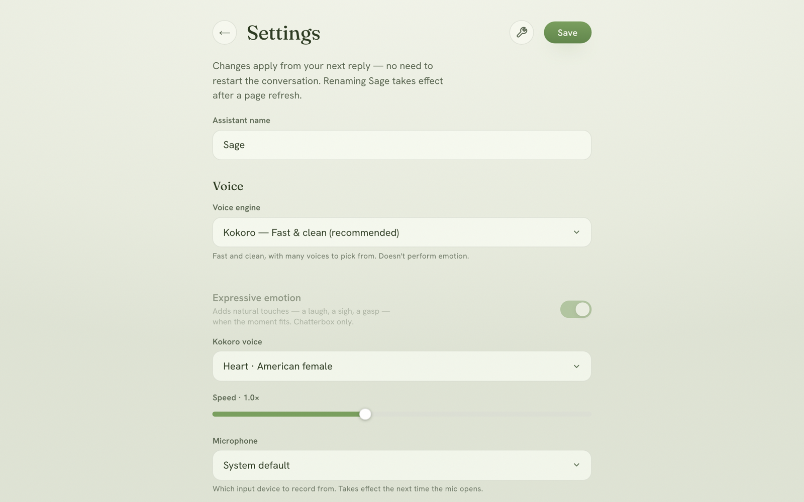

<div align="center">

# ✦ Strata Voice

**A voice assistant that actually remembers you.**

Hands-free conversation. On-device speech. Real, tiered memory.
Runs entirely on your Mac — nothing leaves your machine.

[](#install)
[](#install)
[](#the-models)
[](LICENSE)

[Install](#install) · [Features](#features) · [How memory works](#how-memory-works) · [The models](#the-models) · [Configuration](#configuration) · [Uninstall](#uninstall)



|  |  |  |
| :---: | :---: | :---: |
| Just talk | Memory you can see | Settings in plain language |

</div>

---

Most voice assistants forget you the moment the window closes. Strata Voice is built
around the opposite idea: **your conversations accumulate into memory you own** — durable
facts, an episodic timeline, conversation recaps — stored in a local SQLite database by
[**Strata Memory**](https://github.com/StephenBiele/strata-memory), a tiered,
conflict-aware memory engine. "Remember…", "actually, change that…", and "forget that"
are first-class operations against a real canonical store, not lines in a text file.

Speech never leaves your machine: ASR, TTS, and voice-activity detection all run
on-device via Apple's MLX. The only network calls are to the LLM you choose — local
Ollama by default — plus, only if you switch them on, keyless web lookups
(DuckDuckGo search, Open-Meteo weather).

## Install

```sh
git clone https://github.com/StephenBiele/Strata-Voice.git
cd Strata-Voice
./install.sh
```

The installer checks the prerequisites (Python 3.12, ffmpeg, Ollama — installed via
Homebrew if missing), builds the Python environment, and asks which tier you want:

| Tier | Downloads | Fits | Chat + memory model |
| :--- | :--- | :--- | :--- |
| **Lightweight** | ~10 GB | 16 GB Macs | `gemma4:e4b` (fastest) |
| **Recommended** | ~24 GB | 32 GB+ Macs | `qwen3.6:latest` (36B) |

Then:

```sh
./start.sh
```

Prefer a real Mac app over a browser tab? Build one once:

```sh
./make_app.sh && open "Strata Voice.app"
```

That creates **Strata Voice.app** — a native window with its own Dock icon.
How it behaves:

- **Starting** — double-click the app (or click it in the Dock). It checks for
  Ollama and the voice server, starts whichever isn't running, then opens the
  window. From fully stopped, one double-click brings everything up; the first
  talk asks for microphone access.
- **Stopping** — close the window. It shuts down only what *it* started: a
  server you launched yourself (say, `./start.sh` in a terminal) is left alone
  and keeps running in the background. A stray background server can always be
  stopped with `lsof -ti :8765 | xargs kill`.
- **Moving it** — copying the app to /Applications or the Dock works fine: the
  app is a small shell that points back at this folder, where the real code,
  models, and Python environment live. What *does* break it is moving or
  renaming this folder itself — fix that by running `./make_app.sh` again (and
  re-copying if you keep one in /Applications). Deleting the folder deletes
  the app's insides; the .app alone is not the program.

Otherwise, the classic way:

Ollama starts if needed, the server launches, and your browser opens to
**http://localhost:8765**. Click **Start conversation**, allow the microphone, and
**just start talking** — it hears when you speak.

> **Requirements:** macOS on Apple Silicon (M1 or newer). Non-interactive installs:
> `./install.sh --light` or `./install.sh --recommended`. Re-running the installer is
> always safe — it never touches an existing profile or memories.

## Features

**Hands-free by default** — just talk: on-device Silero VAD detects when you start and
stop speaking and sends your turn automatically. Talking over a reply **interrupts it**
(barge-in). A **mute button** (red when muted) releases the mic entirely — the OS
indicator goes dark until you unmute. Every knob is tunable in plain language — voice
sensitivity, the pause that ends your turn, lead-in padding, minimum speech length — and
a debug switch adds an **in-call live tuning panel** so you can dial it in while actually
talking. Barge-in leans on your browser's echo cancellation: if it interrupts itself
through speakers, use headphones.

**Don't want it listening? Mute or type** — the mute button pauses the conversation
(and the call timer) and hands the mic back to the OS entirely, while a reply in
progress finishes speaking — muting means "stop hearing me", not "stop talking".
Typing while muted gets a text reply, typing while live gets a spoken one. Ending a
conversation keeps you on the call page — one tap starts the next.

**Real memory** — nothing is stored verbatim from a voice transcript. A smoothing layer
rewrites explicit "remember…" requests into clean third-person facts, a background
extraction pass distills implicit ones, and an end-of-call harvest assembles facts
scattered across turns into complete memories. Deletion is instant and rule-based, and
anything you forget mid-call won't be brought up again. See
[How memory works](#how-memory-works).

**Memory hub** — Timeline (every turn, with the facts learned in that moment hanging off
it), Past chats, Memories, and Reference files, in one place. Memory tools propose
cleanups you approve one by one, run recall tests, and re-review past conversations.

**Text chat** — prefer typing? Replies stream in and can optionally be spoken. Voice and
text share one session, one memory, one timeline.

**Incognito** — a ghost toggle for off-the-record conversations: nothing is saved, while
it still uses what it already knows.

**Web lookups (optional, off by default)** — flip one switch and it can check the web
when a question actually needs it: scores, store hours, news, or "can you double
check that?" (it verifies its own previous claim). Weather questions skip search
snippets entirely and pull **live forecast data** (Open-Meteo — keyless, like
everything here). A quick pre-check decides whether to look anything up, answers stay
to a sentence or two, a **sources chip** under each web answer lets you verify the
links, and results live in memory for five minutes for follow-ups, then vanish — web
content never touches the transcript or your memories. Searches go to DuckDuckGo (no
API key), which is why it's opt-in: those queries leave your machine.

**Reference files** — upload a PDF / DOCX / text file (a resume, notes, a story) and ask
about it. Small files are given to the model whole; larger ones are chunked and embedded, so
each question pulls in only the passages relevant to what you asked instead of blowing the
context window.

**Bring any model** — local Ollama out of the box, or any OpenAI-compatible endpoint
(llama.cpp, LM Studio, vLLM, OpenAI, DeepSeek …), including one hosted on another
machine on your network. **The full memory system rides whatever backend you pick** —
explicit remembers, background fact extraction, end-of-call harvest, and recaps all
run through your endpoint; a separate "Memory model" can be chosen from whatever that
endpoint serves. Only semantic-recall embeddings stay on Ollama (point `OLLAMA_URL`
or the Settings URL at any Ollama, local or remote; without one, recall falls back
to inject-everything and memory keeps working). API keys live in the **macOS
Keychain**, never on disk. Full LLM controls (temperature, top-p, max tokens,
context window), a live speech-recognition picker (Parakeet, Whisper, Qwen3-ASR),
voice cadence tuning with A/B preview, and a background-work pill so memory
processing is never invisible.

**Expressive voice (optional)** — switch the voice engine to **Chatterbox-Turbo** in
Settings and the assistant can perform natural laughs and sighs where they fit,
inserted by the model itself from context. It also brings **ten preset voices**
(real public-domain human recordings, CC0) and **voice cloning** — drop in a short
audio clip and it speaks in that voice. Kokoro stays the default: faster, many
voices, neutral. Emotion tags are a spoken performance only — they never appear in
the transcript or your memories.

**A living, responsive UI** — a calm call interface with an orb that breathes, ripples,
and blooms; adapts from desktop to phone (panels slide, the conversation becomes a
bottom sheet).

## How memory works

The assistant sees your profile and current memories every turn. Memory writes flow
through three layers, none of them verbatim:

- **Explicit** — "remember that…" becomes a candidate that a polishing pass judges and
  rewrites into one clean third-person fact ("Has a job interview on Tuesday"). Anchor
  details — names, dates, times, numbers, places — are copied exactly as you said them.
- **Implicit** — a background extraction pass (with recent turns as context, temperature
  0) distills durable facts out of natural speech and skips what it can't confidently
  parse.
- **End-of-call harvest** — when a conversation ends, one pass over the whole transcript
  assembles facts that were scattered across turns ("I have an interview" … "it's next
  Tuesday" … "building internal tools" → one complete memory), and the conversation is
  recapped into the episodic layer so "what were we just talking about?" works next time.

Every fact is source-linked to the verbatim turn it came from (that's the Timeline), so
the ground truth is always one link away. While the store is small, every fact is
injected each turn; past a threshold, Strata's vector + lexical recall selects the most
relevant ones. Forgetting is deterministic and immediate — deletion never depends on an
LLM's judgment — and incognito turns write nothing at all.

## The models

| Role | Model | Runs on |
| :--- | :--- | :--- |
| Speech-to-text | Parakeet V3 TDT (0.6B) — swappable to Whisper / Qwen3-ASR in Settings | MLX, on-device |
| Voice | Kokoro 82M — or Chatterbox-Turbo for expressive delivery, in Settings | MLX, on-device |
| Hands-free VAD | Silero VAD | MLX, on-device |
| Semantic recall | nomic-embed-text | Ollama, local |
| Chat + memory | your pick — tiers above, or any model in Settings | Ollama / any OpenAI-compatible API |
| Web lookups (opt-in) | DuckDuckGo search + Open-Meteo weather — both keyless | network, off by default |

One model handles both chat and memory by default: Ollama loads models one at a time,
so a separate memory model would evict the chat model on every background job (~8 s of
reload each way, measured). The Settings "Memory model" picker exists for machines with
enough RAM to hold two models resident.

## Architecture

```
┌─────────────────────────── Browser (one page) ────────────────────────────┐
│   call UI · orb · hands-free capture · text chat · memory hub · settings  │
└───────────────┬────────────────────────────────────────────┬──────────────┘
                │ /turn/stream · /chat/stream (NDJSON)        │ /vad/feed (PCM)
┌───────────────▼─────────────────────────────┐  ┌────────────▼─────────────┐
│        main server :8765 (one thread)       │  │    VAD server :8766      │
│  Parakeet ASR → LLM → Kokoro/Chatterbox TTS │  │  Silero VAD (mlx-audio)  │
│   background: memory worker · recap+harvest │  │  speech start/stop       │
└───────────────┬─────────────────────────────┘  └──────────────────────────┘
                ▼
┌─────────────────────────────────────────────┐
│         Strata Memory (local SQLite)        │
│    verbatim turns ← facts ← recaps          │
│    supersession · semantic recall · links   │
└─────────────────────────────────────────────┘
```

The main server is single-threaded on purpose (MLX's GPU stream lives in the thread
that loaded the models); everything slow — memory writes, recaps, fact harvest — runs on
background threads, and the VAD channel rides its own port so barge-in detection keeps
working while a reply is streaming.

## Project structure

```
Strata-Voice/
├── server.py       web server: UI + REST API (turns, memory, sessions, settings),
│                     the VAD micro-server, and the background memory workers
├── voicechat.py    models + pipeline: ASR/TTS loading, LLM calls, prompt assembly,
│                     the Strata Memory integration; also a minimal CLI mode
├── index.html      the entire front-end, one file
├── install.sh      one-command installer (tiers, models, prerequisites)
├── start.sh        start Ollama + the server, open the browser
└── uninstall.sh    guarded uninstaller — prompts before every destructive step
```

Your data lives in `~/.vui/` (profile, transcripts, memories, uploads) — outside the
repo, never committed, and untouched by reinstalls.

## Configuration

Most things live in **Settings**. Startup options are env vars:

| Var | Default | Notes |
| :--- | :--- | :--- |
| `VOICE_HOST` | `127.0.0.1` | bind address — set `0.0.0.0` to reach the app from other devices on your network |
| `VOICE_PORT` | `8765` | web server port |
| `VOICE_VAD_PORT` | `8766` | hands-free VAD channel |
| `VOICE_NAME` | `Sage` | initial assistant name |
| `VOICE_LLM_MODEL` | `qwen3.5:4b` | default Ollama model (the installer seeds your tier's pick) |
| `VOICE_ASR_MODEL` | `mlx-community/parakeet-tdt-0.6b-v3` | ASR model id (or pick in Settings) |
| `VOICE_TTS_CHATTERBOX` | `mlx-community/chatterbox-turbo-fp16` | expressive engine id (used when the voice engine is Chatterbox) |
| `OLLAMA_URL` | `http://localhost:11434` | Ollama endpoint (chat + embeddings) — may be another machine on your network |

## Uninstall

```sh
./uninstall.sh
```

Prompts before each step — the Python environment, your data (`~/.vui`, asks twice),
the Ollama models, the cached speech models — then you delete the folder. Nothing is
removed without a yes.

<details>
<summary><strong>Manual install</strong> (what the script does)</summary>

```sh
python3.12 -m venv .venv
.venv/bin/pip install -r requirements.txt   # strata-memory pins from GitHub
ollama pull gemma4:e4b && ollama pull nomic-embed-text
ollama serve                                 # if not already running
.venv/bin/python server.py
```

CLI-only mode (terminal push-to-talk, no UI): `.venv/bin/python voicechat.py`

To develop against a local strata-memory checkout:
`.venv/bin/pip install -e ../strata-memory`
</details>

## Acknowledgements

Built on [Strata Memory](https://github.com/StephenBiele/strata-memory),
[mlx-audio](https://github.com/Blaizzy/mlx-audio) /
[Kokoro](https://huggingface.co/hexgrad/Kokoro-82M) /
[Parakeet](https://huggingface.co/mlx-community/parakeet-tdt-0.6b-v3),
[Chatterbox](https://github.com/resemble-ai/chatterbox) (Resemble AI),
[Silero VAD](https://github.com/snakers4/silero-vad), and [Ollama](https://ollama.com).
Optional web lookups use [DuckDuckGo](https://duckduckgo.com) search and
weather data by [Open-Meteo](https://open-meteo.com) (CC BY 4.0).

## License

[MIT](LICENSE)

<div align="center">
<sub>✦ your conversations, your memory, your machine</sub>
</div>
